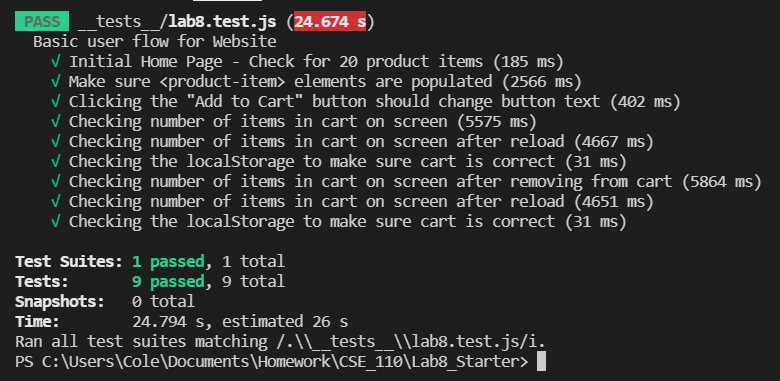
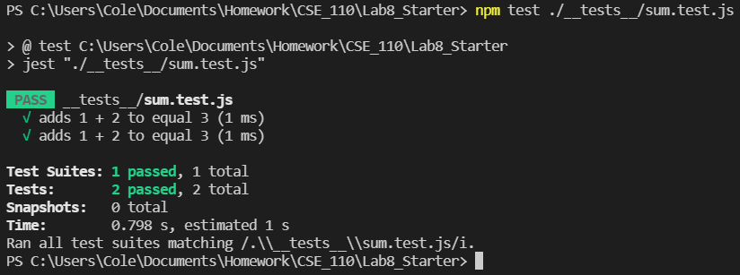
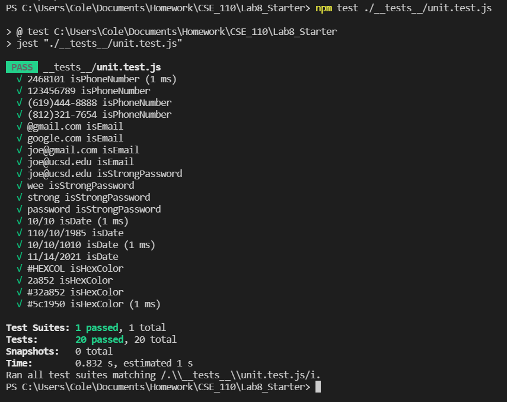

# Lab 8 - Starter

Cole Rindal

1) Within a Github action that runs whenever code is pushed, because this ensures that the tests will be ran every time even if people forget to run the tests manually.

2) No unit testing would be better to test the output of a single function.

3) No, using unit testing wouldn't test the whole interaction of sending and recieveing a message, an end to end test would be better for this.

4) Yes this is a perfect thing to unit test because it is a small feature that isn't reliant on other features of the app to function.

